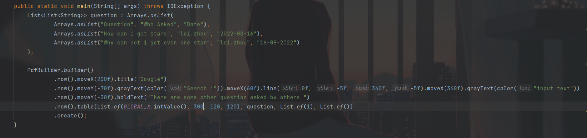
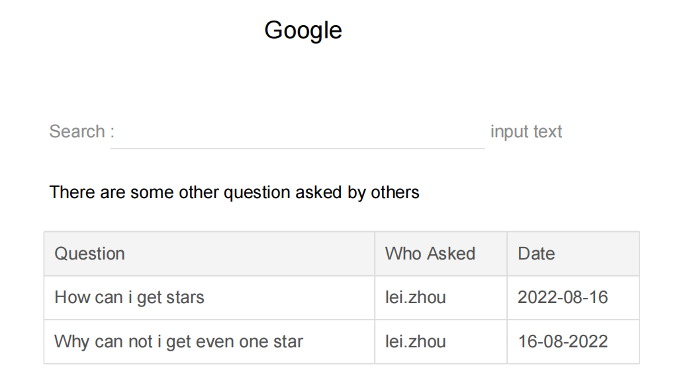
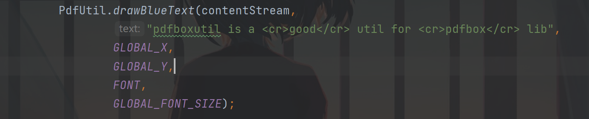
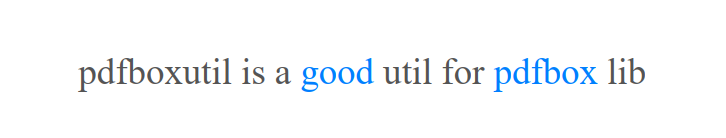
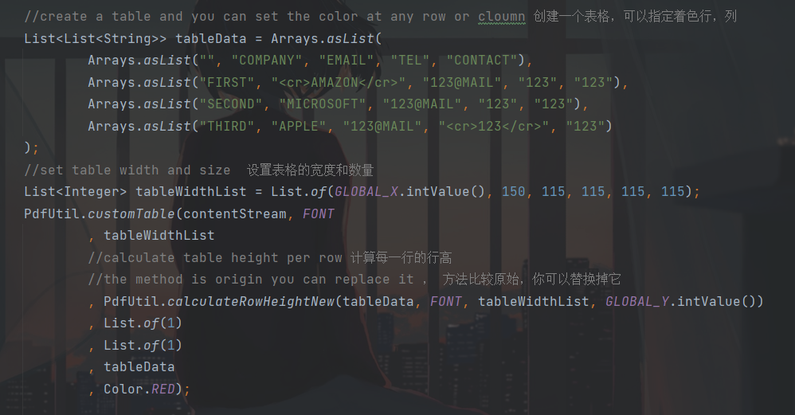
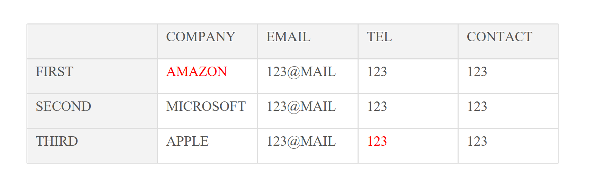

# This is a util for pdfbox

## feature 1 : 
you can use it draw colorful text with the color tag (<cr> any text</cr>) and no matter where the tag is. it means you can put the tag anywhere it will work.

## feature 2 :
you can use the util draw a table, you can set the color at any row or cloumn

## feature 3:
it is just a class file not a jar, it means you can easily put it in you project and add any new feature by rewrite the method!!

## feature 4:
demo is in the project

## feature 5:
new method pdfBuilder is created! you can use it to create your own pdf!

# 这是为pdfbox写的一个小工具

## feature 5:
新增了pdfBuilder方法，你可以用它创建pdf了！

## feature 1 :
你可以用它绘制带颜色的字符串，不管这个tag标签在哪里都可以

## feature 2 :
你还可以用它绘制一个表格，还可以指定哪行哪列进行着色，或者哪些文字需要颜色

## feature 3:
这只是一个class文件，意味着你可以把它放到任何地方或者随意进行修改

## feature 4:
项目里有几个简单的demo

# example

## pdfBuilder !!!

## color text

## create your own pdf

